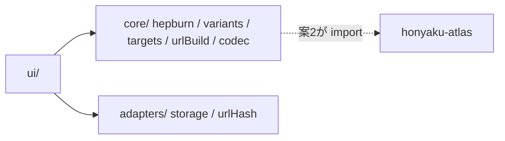

# IMPLEMENTATION_GUIDE.md — 実装ガイド: honyaku-query

> **プロセスは AGENTS.md が正。** 本ファイルは「このプロジェクト固有の設計判断」だけを持つ。

## 1. アーキテクチャ概要

3層構成(core / adapters / ui)。core のうち hepburn / variants は
**honyaku-atlas から import される共有モジュール**であり、特に純度を守る(NFR-004)。



## 2. ディレクトリ構成

```
src/
├── core/
│   ├── types.ts       # Reading, Variant, Target, Result
│   ├── hepburn.ts     # かな→ヘボン式(REQ-001)★共有対象
│   ├── variants.ts    # バリアント展開(REQ-002)★共有対象
│   ├── targets.ts     # 検索ターゲットマスタ + 検証(REQ-003)
│   ├── urlBuild.ts    # URL 生成・エンコード(REQ-003)
│   └── codec.ts       # 状態 ⇔ URL ハッシュ(REQ-006)
├── adapters/ storage.ts / urlHash.ts
└── ui/ app.ts / render.ts / messages.ts
```

## 3. 設計原則(このプロジェクト固有)

- **変換はトークナイズ→変換→後処理の3段**: (1) かな列を最長一致でトークン化(拗音2文字優先)(2) トークン→ローマ字表引き (3) 促音・撥音・長音の後処理をこの順で適用。段ごとにテスト可能にする
- **共有モジュールの純度**: hepburn.ts / variants.ts は import ゼロ(types.ts のみ可)。targets や DOM に触れたらレビューで差し戻す
- **バリアントは (規則, 優先度) のタグ付き**で生成し、UI が「なぜこの表記が出たか」を表示できる形にする
- **NFC 正規化は adapters/入力境界で1回**。core は正規化済み前提(二重正規化しない)

## 4. エラーハンドリング方針

- core: Result 型。`unconvertible` は位置(index)と該当文字を返し、UI が該当箇所をハイライトできるようにする
- adapters: 例外は握りつぶして null / no-op

## 5. 実装順序(推奨)

1. hepburn(REQ-001): 規則単位に Red → Green。大きければ3PRに分割(STATE 参照)
2. variants(REQ-002)→ targets/urlBuild(REQ-003)
3. UI(REQ-004)→ **Vercel 初回デプロイ** → REQ-005 / 006 / 007

## 6. 既知の設計上のトレードオフ

| 判断 | 採用理由 | 将来の見直し条件 |
|---|---|---|
| 読みはユーザ入力(推定なし) | 正確性・バンドル最小 | 頻出作家の読み辞書(定数)を補助入力として付ける案は需要次第 |
| LC 翻字(図書館目録形式)を独立規則にしない | ヘボン式+バリアントでほぼ被覆できる | WorldCat 系でヒット率が悪い報告が出たら規則追加 |
| ターゲットマスタはコード内定数 | 10〜15件規模 | 30件超で YAML 化(hashigo 方式) |
